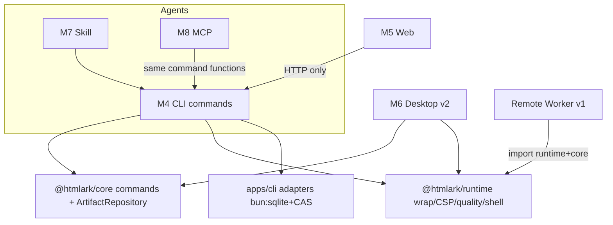
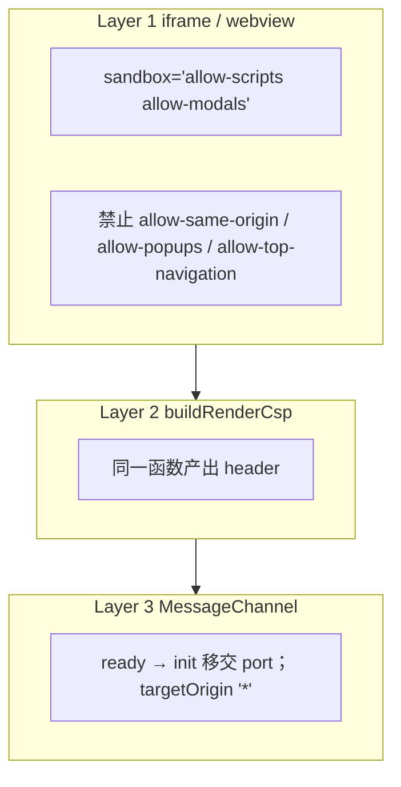

# htmlark：本地优先的 Agent 产物运行时

**PRD + 技术设计**

| 字段 | 值 |
| --- | --- |
| 文档标题 | htmlark：本地优先的 Agent 产物运行时 |
| 作者 | TBD |
| 日期 | 2026-09-03 |
| 状态 | Draft（定位收窄：本地 coding-agent artifacts；非完整 Claude Artifacts 替代） |
| 产品名 | **htmlark**（CLI `htmlark`；包 `@htmlark/runtime` `@htmlark/core`；应用 `apps/cli` `apps/web` `apps/remote`） |
| 域名（待注册确认） | `htmlark.dev` / `htmlark.app` / `htmlark.com` — 2026-09-01 DNS 探测为 NXDOMAIN，**不是购买保证**。抢注失败则 fallback：`stillbox` 或 `relicary` |
| 定位 | **给所有 coding agent 共用的本地 Artifact 库：** 生成即预览、同一身份持续更新、版本可回溯；需要时发布到自己的 remote。**不是**完整 Claude Artifacts 替代。**与 Teable 无关。** |
| 团队规模 | 1–2 名工程师 |
| MVP 工期 | **6–8 人周**（诚实估计，含 Skill 手工评测） |
| 许可 | **MIT** |

本文是一份给小团队落地的 **PRD × 技术设计** 混合文档：先锁产品命题与模块边界，再给出可实现的数据模型、Agent 契约、分阶段范围和按 PR 拆分的施工顺序。

---

## Overview

Coding agent（Claude Code、Codex、Cursor、OpenCode）已经能稳定产出**可独立打开的视觉产物**：单文件 HTML、图表、仪表盘、Markdown 报告。这些文件今天死在 Downloads 或某一家云托管里。

htmlark **替代的是 Claude Artifacts 里「静态 HTML/Markdown 工作流」那一块**，不是整个 Claude Artifacts 产品。Claude 已有自动预览、gallery、公开链接、评论、React、查看时 MCP 拉数；[Claude Code 亦有原生 Artifacts](https://code.claude.com/docs/en/artifacts)。htmlark 不追这些。

真正差异：

> **本地 origin、任意 coding agent、无需 Claude 账号、离线、可迁移、确定性运行时。**

MVP 承诺：

> 本地 coding agent 用户可以生成、持续更新、预览、回溯和重新打开一个静态 Artifact；数据不离开本机。分享方式仅为导出文件。

英文：*Artifacts for every coding agent — local-first, versioned, and portable.*

不宣传：「完整替代 Claude Artifacts」「ChatGPT / Claude.ai 一等公民」「需要时丢 URL」（MVP 做不到）。无官方托管则接受：这是私密、跨 Agent 的本地替代，不是零配置完整替代品。

---

## Background & Motivation

### 今天的断裂

一次典型工作流：

1. 在 Claude Code 里让模型「做一份 Q3 销售仪表盘」→ 得到 `./dashboard.html`
2. 用浏览器打开，CDN 被拦或样式漂移；或者直接丢进 Claude.ai artifact 侧栏，会话一关就找不到
3. 第二天换 Codex 改一版 → 模型从记忆重写整页，配色、字号、图表库全换
4. 发给同事 → 传文件 / 传截图 / 传到某云，URL 和身份对不上
5. 一周后想对比 v1 / v3 → 没有版本，没有 diff，没有「当时用的是哪个模型」

痛点可以压成三句话：

| 痛点 | 表现 | 根因 |
| --- | --- | --- |
| **无家** | 产物散落在 chat / Downloads / gist | 没有本地权威库 |
| **不可复现** | 同一交付物每次生成长得不一样 | 只靠 prompt，没有 pin / 版本 / 同一运行时 |
| **不可调用** | SaaS 看不到本地 MCP；本地 CLI 又进不了 Claude.ai | 缺「本地 stdio + 用户 remote HTTP」双表面 |

「跨模型看起来差不多」是 v1 的 Recipe/tokens 问题；MVP 先保证 **同一 authored hash 在同一 htmlark runtime release 上 render deterministic**。

### 竞品地图（定位，不抄）

| 产品 | 强项 | 缺口 | htmlark 采取 |
| --- | --- | --- | --- |
| **Claude Code Artifacts** | 自动开浏览器、会话内原地更新、gallery、private/org/public、评论、查看时 MCP | 要 claude.ai 登录与 Anthropic 托管；API key / Bedrock / Vertex / 合规环境常不可用；产物不跨 Codex/Cursor | **最大竞品。** htmlark 吃离线、敏感、多 Agent、数据不出本机。不追 React / 评论 / 官方托管 |
| **Artifacty** | 本地 exchange、SQLite 追加版本、CLI/HTTP/MCP、多 Agent 一键安装、serve 生命周期、browser edit/diff、多格式、FTS、loopback 保护 | 无 htmlark 这种确定性 runtime / vendor pin / authored≠rendered / opaque-origin CSP / CAS provenance / 用户自有 remote | **「本地+MCP+版本」不是原创。** 差异必须是 runtime 严格性 + CAS + 视觉 artifact 体验（live-follow、viewer） |
| **coda0 / Open Artifacts** | 官方托管 coda0.com、Skill、same URL、密码与客户端加密、Recipe/fragments/smoke、OG、D1/R2 self-host | **不是 local-first**；直传 HTML 被拒 | 不跟它拼 Recipe 库、smoke、托管发布。优势：**本地是 origin，云是 mirror** |
| **Teable Artifact** | CSP sandbox、vendor pin、wrap | 绑 Teable chat；写入不拒 CDN | **仅运行时先验。** 零 Teable 代码 |
| **Gemini Canvas / ChatGPT Sites / v0 / Lovable / Bolt** | chat 内预览、公开 URL、full-stack deploy | 不是 local-first 库 | **不追。** MVP 不加 React、数据库、auth、多人实时、生产部署 |
| **HTML Browser / Imbas / Open Design** | viewer / vault / 设计工作台 | 不是跨 Agent 写入口 | Desktop v2 才碰 viewer 壳；不抢工作台 |

**一句话：** htmlark 是 coding agent 的本地 artifact origin。Claude Artifacts 是托管会话产物。Artifacty 已做出本地 MCP 形状。Open Artifacts 是 cloud publisher。

### 为什么是独立产品（核心，不是可选项）

- 这是**个人项目**：各种 AI 工具都能用。产物生命周期跨越 Claude Code / Codex / Cursor / OpenCode / ChatGPT / Claude.ai，**不属于任何一张表、一个 base、一次聊天、一家厂商。**
- 安全边界要求「永不在带 cookie 的 origin 上裸奔 agent HTML」。
- **永不**作为 Teable 功能或 Teable 包存在。Teable Artifact 的 CSP / vendor regex / wrap-at-render 可以抄思路，代码与包必须独立实现。若将来 Teable 想依赖 `@htmlark/runtime`，那是 *他们* 的选择，本项目不为此设计、不排期、不承诺。

---

## Goals & Non-Goals

### Goals

1. 离线可完成 create / preview / source-diff / restore / 次日重开。vendor 命中缓存后零网络。
2. 稳定 `art_…` **加** 项目内 logical key（`--key q3-sales` 创建或更新）。客户端预生成 id。
3. 同一 runtime 包渲染：CLI preview / viewer /（v2）Desktop。
4. MVP 可复现 = authored 精确 + 写入时 vendor pin + 同一 runtime release 的 wrap/CSP/tokens。
5. **MVP 一等公民 = coding agent：** Claude Code、Codex、Cursor、OpenCode，以及本机 agentskills.io agent。ChatGPT / Claude.ai **不是** MVP 一等公民（要到 v2 HTTP MCP）。
6. HTML 运行时：opaque-origin sandbox、`default-src 'none'`、禁止 CDN/`latest`。
7. 本地无账号。**v1 = 单向 publish 到用户 self-host remote**（稳定 URL），不是双向 sync 平台。无官方托管。无 OAuth。
8. MVP 1–2 人 **6–8 人周**。Desktop 不在窗口。
9. 与 Teable 无关。

### Non-Goals（明确砍掉）

| 不做 | 理由 |
| --- | --- |
| 完整替代 Claude Artifacts | React、评论、组织分享、查看时 MCP 拉数、官方托管都不做 |
| 聊天应用 / agent 编排 | 不是 Open Design |
| 多文件静态站点（MVP/v1） | 单文件 HTML/MD |
| 实时数据 / 产物内调 MCP | 与离线可复现冲突 |
| 多用户权限、评论、RBAC | v2 |
| React/TSX 管线 | 单文件 HTML |
| 官方多租户托管 | 协议 + Worker 参考 + self-host；一键 URL 体验因此不承诺 |
| v0 / Lovable / Replit 的 full-stack deploy | 错赛道 |
| ChatGPT / Claude.ai 接入（MVP **和 v1**） | v2 HTTP MCP |
| 双向 sync / adopt / `sync_conflicts`（v1） | v1 只单向发布 |
| `--lan` / 公开 URL（MVP） | MVP 分享 = export 文件 |
| Desktop（MVP **和 v1**） | v2 |
| Teable 耦合 | 核心否决 |

### 硬约束

- 每版本内容 ≤ **5 MB**（对齐 Teable；coda0 是 4 MiB。这是产品选择，不是行业标准）。
- 单文件 HTML 或 Markdown。图片仅 `data:` / inline SVG。
- Vendor：`/vendor/<pkg>@<exact-semver>/<file>.js|.mjs|.css`。拒绝 `latest`、`^5`、unpkg/jsdelivr/cdnjs。
- 渲染永远在 sandbox 里。**dirty 版本拒绝渲染**（见 D15）。
- `file://` 只用于 export。预览与分享走 HTTP。

---

## Personas

### P1 — Solo coding-agent 用户（MVP 唯一用户）

每天用 Claude Code / Codex / Cursor。希望生成即预览、换 agent 改同一份、离线打开 v3、次日还能找到。MVP **不能**「丢 URL 给同事」；同事要文件就 `export`。

### P2 — 小团队（v2）

共享与评论。v1 最多是「发布到自己的 remote，把 URL 丢进 Slack」（单向、无协作账号）。

### P3 — AI SaaS 写入用户库（**v2**）

Claude.ai / ChatGPT 看不到本机 stdio。它们若接入，连的是用户 remote 的 HTTP MCP。不是 MVP/v1。

---

## Product Vision

> 给所有 coding agent 共用的本地 Artifact 库：生成即预览、同一身份持续更新、版本可回溯，需要时发布到自己的 remote。

成功标准（MVP）：

- 第一次 create 后，不再把 HTML 丢 Downloads。
- `htmlark open` / Skill 发布后浏览器自动打开；已打开的 `/a/:id` **跟随 head**（可钉版本）。
- 同一 `--key` 不会变成两个 artifact。
- loopback 自用；给人看用 `export`。

v1 成功：一条命令把**固定版本或 latest** 发到自己的 Cloudflare remote，得到稳定 URL；可 revoke。**不**做远端回写。

---

## User Journeys

### J0 — 安装与连接（MVP，必须）

```
htmlark setup          # 写 Skill 到用户 skills 目录；打印 MCP stdio 片段
htmlark check          # binary、HTMLARK_HOME、MCP 配置、可用 agent 探测
htmlark open --id …    # 若 serve 未跑则拉起 loopback，再打开浏览器
```

验收：不要求先开第二个终端跑 `serve`。重启后 `open` 仍能拉起。

### J1 — Claude Code 创建（MVP 主路径）

1. 用户：做一份 Q3 销售仪表盘
2. Skill：`htmlark put --key q3-sales --file ./q3-sales.html --name "Q3 Sales" --json`
3. 写入 art_… v1，**自动 open** `/a/:id`（follow-head）
4. JSON 含 `id`、`key`、`next`

验收：预览无需手动 `serve`；gallery 有卡片；质量门拒 CDN。无 `--key` 的纯 create 仅人类用，Skill **强制** `--key`。

### J2 — 换 Codex 迭代同一 key（MVP）

1. `htmlark put --key q3-sales --file … --json` → 同一 id 追加版本
2. CONFLICT：get → 再应用 → `--base-version`
3. 已打开的 `/a/:id` **自动刷新到 head**。`?v=N` 钉住
4. viewer：Preview / Source / Versions / Diff / Copy / Download

验收：不会出现第二个 Q3 artifact；v1 仍可钉开。

### J3 — 给人看（MVP = 导出文件）

- `htmlark export --id art_… --out q3.html`
- loopback `/a/:id` 只给本机
- **无 `--lan`。** 同事收文件，或等 v1 publish

验收：skill/文档不准写「把 URL 发给同事」。

### J3b — 导入脏 HTML（MVP）

1. `htmlark import --file ~/Downloads/claude.html --key from-claude --json`
2. 门失败 → `dirty=1`，`/render` 409，JSON `errors[]` 机器可读
3. Skill 把 errors 交回 agent → `put --key` 追加干净版本
4. **无自动 HTML rewrite**

### J4 — 单向发布（v1）

```
htmlark remote init
htmlark publish --id art_… --remote origin [--follow-latest | --version N]
htmlark unpublish --id art_…
```

稳定公共 URL。可选密码。source 是否公开必须明示。fork 回本地是新 art_。

**v1 不做：** remote 回写、SaaS HTTP MCP、adopt、双向 sync、`sync_conflicts`。

### J5 — Claude.ai / ChatGPT 写入（**v2**）

远程 HTTP MCP、CREATE_TOKEN、adopt。不在 v1。

---

## Key Decisions

每一条都是后续实现的约束。要改，先改本文再改代码。

| # | 决策 | 理由 |
| --- | --- | --- |
| D1 | **本地库是 origin。云是 git-like remote。** | 离线、隐私、跨 SaaS。 |
| D2 | **id = `art_` + Crockford Base32(14 个随机字节的高 110 bit) = 22 字符。** 字母表 `0123456789ABCDEFGHJKMNPQRSTVWXYZ`，规范形式大写、无 checksum、无 padding。**客户端预生成；remote `POST` 必须接受 `id`；碰撞 409。** | 22×5 = 110 bit，不可枚举。14 字节提供 112 bit，丢弃最后 2 bit。与 Teable 的 `art`+16 `[0-9a-zA-Z]`（无下划线，~95 bit）刻意区分。 |
| D3 | **内容 = 自包含 HTML 或 Markdown。** 无 Recipe 也可入库。Recipe 是推荐的 agent 路径，不是入库前置。 | 现实文件是整页 HTML。脏文件走 D15，不是关掉质量门。 |
| D4 | **渲染永远走 `@htmlark/runtime` 纯函数：** `wrapArtifactDocument` + `buildRenderCsp({frameAncestors})` + opaque-origin `sandbox allow-scripts allow-modals`。CLI / Worker / Desktop / 测试调用同一函数。 | Teable 已验证 header CSP sandbox。多 host 若各写一份 CSP 字符串，Goal 3 立刻假。 |
| D5 | **Vendor 只走 same-origin pin proxy，exact semver。** 数字上限与 SSRF 规则写在本文 Vendor 节，独立实现，**禁止 import Teable。** | `latest` / CDN 破坏复现与 CSP。 |
| D6 | **MVP 可复现 = authored 字节不变；同一 `@htmlark/runtime` release 下 wrap/CSP/token 注入 deterministic。** `/render` 字节不入库、不参与 hash。不承诺跨 runtime 版本字节级同一 HTML。跨 agent 视觉相似、fragments、五套风格 = **v1**（那时才加 `renderProfileVersion` + `tokensHash` + `vendorManifest: spec→sha256`）。 | 渲染期注入当前 `DEFAULT_TOKENS_CSS`；wrapper 随 runtime 升级。虚假「跨 host 永远同一 HTML」会在升级后打脸。 |
| D7 | **三套 Agent 表面同构。唯一 writer 是 `@htmlark/core` 的 application command functions**（`createArtifact()` 等）。CLI / HTTP / MCP 都是 driving adapters，调用这些函数，禁止第二条 SQL 路径。SaaS 走用户 remote 的 HTTP/MCP。 | 否则 list/409/`next` 会分叉。CLI 不是领域。 |
| D8 | **Desktop 是本地 HTML runtime，不是聊天应用。排期 v2。** 模式名 **`sandboxed` / `network-allowlist`**，不用 Safe/Trusted（HTML Browser 的 Safe = 禁 JS，含义相反）。 | 1 人团队 v1 要做 remote。Agent 也调不了 Desktop。 |
| D9 | **per-artifact `writeToken`（`wt_` + 32 字节 hex）+ 实例 `CREATE_TOKEN`（`ct_` + 32 字节 hex）。两者都只展示一次，远端只存 SHA-256。v1 无 OAuth。** Remote MCP = create/update/get-one，**无 list、无 inbox。** SaaS 新 id 靠 **`htmlark remote adopt --id`** 进本地库；`sync --pull` 无 `--id` 只刷新已知 id。rotate 不改 id。 | 实例级 bearer / remote list 等于 god mode。无 list 就必须有 adopt，否则 J5 收编是空话。 |
| D10 | **`sync` 只推缺失版本，永不改写历史。** restore = append，列 `restored_from`。**Pull 的唯一内容路径是 `GET /v1/artifacts/:id/versions/:n/raw`（authored 字节；hash 对它，不对 `/render`）。跳过 `dirty=1` head，不 push。** | 用 wrap 后的 HTML pull 会分叉 CAS。脏文件在远端执行不了，也不该扩散。 |
| D11 | **库 UI（Vite SPA）只在 loopback `/`。** `/a/:id` 不是 SPA 路由。render 必须 `buildRenderCsp`。产物 HTML 只出现在 `/render/*`。 | stored-XSS；LAN 403 `/assets` 会弄死 SPA。 |
| D12 | **默认 bind `127.0.0.1`。`--lan` 只开放已分享产物的 GET `/a` `/render` `/vendor`（无 `/assets`）。** `shares` **行只由 `htmlark share` INSERT**；无行 ≡ 未分享 ≡ LAN 404。revoke 置 `enabled=0` 保留行。无 `shares.lan` 列。 | 否则 `--lan` = 向咖啡厅开放写 API 和整个库；`enabled DEFAULT 1` 若在 create 时插行，等于默认全开。 |
| D13 | **独立仓库、零 Teable 依赖、不为 Teable 预留嵌入。** Teable Artifact 仅 References 里的 CSP 先验。 | 个人项目；各种 AI 工具都能用。这是核心，不是可选项。 |
| D14 | **MVP 残酷砍：** 无 Desktop、无云 remote、无 SaaS MCP、无视觉 diff、无 `--lan`、无公开 URL、无 FTS、无 doctor 改写、无 ChatGPT/Claude.ai。**必须有：** `setup`/`check`、`open` 自拉起 serve、`put --key`、follow-head、viewer（Preview/Source/Versions/Copy/Download）、export、机器可读质量错误。 | 步骤太多赢不了 Claude 体验；扩 scope 赢不了 coda0。 |
| D15 | **`import` 与人类 `--force` 可以把质量门失败的 HTML 存成 `dirty=1`，但 `/render` `/a` 拒绝执行直到出现干净新版本。** Agent `create`/`update` 无 `--force` 硬失败。MCP 工具 **不接受** `force`。MVP 干净版本靠人类 `update`；`recipe doctor` 改写 CDN 是 v1。 | 关闭「吞脏文件 vs 硬拒」的假两难。 |
| D16 | **包边界（Bun）：** `@htmlark/runtime` = wrap/CSP/vendor regex/tokens/quality/`injectTokensCss`/`buildViewerShell`，**零 I/O**。`@htmlark/core` = commands + `ArtifactRepository` 端口，**禁止** `bun:sqlite` / `node:fs` / Hono。`apps/cli` = 本地适配器（bun:sqlite+CAS、vendor cache）+ transports（cli/http/mcp）+ embed web。`apps/remote` = D1+R2 适配器 + Hono。**Worker import runtime+core，永不 import 本地适配器。** 实现语言 **TypeScript + Bun**。Go 因无法跨 Worker 共享 wrap 实现而拒绝。分发：`bun compile`（~60MB，接受）。 | workerd 进不了文件 sqlite。质量门必须随 runtime。同一 import 是 D4 的实现。 |
| D17 | **Agent CONFLICT 协议：** `code=CONFLICT` → get → 再应用 → `update --base-version`。Sync 版本号同、hash 不同：记 `sync_conflicts`，**不中止整库**；`htmlark sync --take local\|remote` 把胜者 **append 为 N+1**，败者保留。J5 happy path = 单 writer。 | 双写是稳态，不是异常。 |
| D18 | **Remote PUT 送 `baseVersion`（期望 head），server 分配 `head+1`。** Remote **没有 `force`。** 同 hash + 同目标 version 的重试 → 200 幂等。禁止空洞 version。 | 与 coda0 `baseVersion` 对齐。脏内容根本不 sync（D10），不需要 remote force。 |
| D19 | **`GET /a/:id` = `buildViewerShell({title, version, renderUrl})` 生成的独立 HTML**（inline CSS/JS + iframe `/render`），**不是** Vite gallery SPA。Gallery 留在 loopback `/`。`/render/:id/:version` = CSP 沙箱文档。本地与 Worker 调同一函数。Slack 贴 `/a/:id`。无 `?v=` 表示 head。 | LAN 403 `/` 与 `/assets`；若 `/a` 是 SPA 路由，J3 必挂。 |
| D20 | **`--json` opt-in；skill 强制带。** TTY 默认人话。人类可以 `--json --force`；MCP 无 force。 | 结束「默认到底是不是 JSON」的自相矛盾。 |
| D21 | **分享 URL 就是 `/a/:id`（unlisted id）。没有单独的 `shareId`。** | Teable 有 `shareId` 是因为同一产物要轮换链接；htmlark MVP 用 revoke=disable。rotate URL 等于换 id，不做。 |
| D22 | **产品名 `htmlark`。** CLI `htmlark`；npm `@htmlark/runtime` `@htmlark/core`（`apps/cli` 是二进制，不是第三套领域包）；skill `htmlark-authoring`；bridge `source: 'htmlark-runtime'`；token 属性 `data-htmlark-tokens` / `--htmlark-*`；家目录 `$HTMLARK_HOME` 默认 `~/.htmlark`。id 前缀 `art_`。域名候选 `htmlark.dev` / `.app` / `.com`，**注册前必须确认**；被占则 fallback `stillbox` 或 `relicary`。 | `locus.dev` / `locus.io` 已被占用。 |
| D23 | **许可 MIT。** PR-01 加入 `LICENSE`。 | 用户拍板。利于任意 agent / 工具链使用。 |
| D24 | **无官方托管。** v1 = 用户 self-host 的 **单向 publish**（Worker 参考 + `remote init`）。不做 htmlark.com 多租户。 | 一键可分享 URL 因此不是零配置；这是定位取舍。 |
| D25 | **Teable 只是先验，不是路线图。** 不计划、不排期、不承诺被 Teable 嵌入。 | 用户：「和 teable 无关，这是我的个人项目」。 |
| D26 | **loopback ≠ 持有机器。** 精确校验 `Host`（仅配置的 loopback host:port）。mutation 只接受 `application/json` + 启动时随机 `X-Htmlark-Token`。拒绝跨 Origin mutation；无宽松 CORS。`/` 与 `/a`：`frame-ancestors 'none'`（`/a` 的 iframe 用实际 viewer origin，禁止 `*`）。真浏览器测试：`evil.test` 页不能 list/create/update。 | 恶意网页可打 127.0.0.1；DNS rebinding 绕过同源。[GitHub Security Lab](https://github.blog/security/application-security/localhost-dangers-cors-and-dns-rebinding/) |
| D27 | **本地 origin 端口：** commands 依赖 `ArtifactRepository` + `ProjectArtifactRegistry`（`--key`）。**v1 云是 `ArtifactPublisher`，不是第三个 Repository。** Memory/SqliteCas 实现 repository；Json/Memory 实现 registry；D1+R2 实现 publisher。无 DI。 | 单向 publish 不是可替换数据库。 |
| D28 | **CAS 崩溃顺序冻结：** tmp 文件 → `fsync(file)` → rename → 必要时 `fsync(dir)` → `BEGIN IMMEDIATE` → 写 version/head → commit。禁止先提交 SQL 再写 blob。失败最多 orphan blob；`doctor` 查 missing blob，GC 收 orphan。并发：SQLite 写事务 + `busy_timeout=5000`。POSIX `flock` 不是领域端口；若本地还要进程锁，留在 adapter 并声明平台。`$HTMLARK_HOME` 禁止放 NFS / iCloud / Dropbox。 | 断引用不可恢复；orphan 可 GC。Windows 无 POSIX flock。 |
| D29 | **规范 JSON 不返回 CAS 物理路径。** 全文用 `get --out`。CAS 文件 best-effort 只读；`doctor` 校验 hash。 | `path: ~/.htmlark/blobs/…` 诱使 agent 改 CAS，破坏不可变与去重。 |
| D30 | **D1 只做索引。** 元数据/versions/hash/tokens 指针进 D1；artifact/recipe/vendor **字节进 R2**。永不把 `content` 塞进 D1（行上限 2MB，产物上限 5MB）。不宣称本地 DDL 与 D1 字节级相同。 | [D1 limits](https://developers.cloudflare.com/d1/platform/limits/) |
| D31 | **version 是完整快照：** `versions` 存该版 `name`/`type`/`tags`/`recipe_hash`/`blob_hash`。`artifacts.*` 是 head 缓存。restore 恢复内容 **和** 当时元数据。 | 只版本化内容会让 sync/restore/diff 长满例外。 |
| D32 | **`/vendor/:spec` GET 不回源。** create/update 时解析并预取，写入 version 的 vendor manifest（MVP：磁盘缓存 key=spec；v1 加 sha256）。GET 只 serve 已被某版本引用且已缓存的文件。检查 IPv4-mapped IPv6、CGNAT；连接应钉到已验证地址。 | 公开 GET+10MB 上游 = unpkg 放大代理。 |
| D33 | **`buildViewerShell`：** 所有文本 HTML-escape；`renderUrl` 用 URL parser 构造，禁止字符串拼接；用户数据不进 inline JS。测试：`</title><script>`、引号、Unicode separators。 | title 来自 agent；壳在 trusted parent origin。 |
| D34 | **库：** Zod 4（core schemas）。Hono：**`createLocalApp` / `createPublishApp`，禁止返回类型写成 `Hono`**（擦掉 RPC）。Web 只 `import type { LocalAppType }` + `hc<LocalAppType>`。Remote client：`fetch` + Zod parse，不用 `hc`。CLI citty + `safeParse`。MCP **`@modelcontextprotocol/server` v2** stdio（不是旧 `@modelcontextprotocol/sdk`）。类型检查：`typescript@7` + `tsc --noEmit` + `svelte-check`；`strict` / `noUncheckedIndexedAccess` / `verbatimModuleSyntax` / `moduleResolution: bundler`。测试：`bun:test`（core/adapter）；**Playwright MVP**（evil.test、CSP、follow-head）；**`@cloudflare/vitest-plugin` v1**。`bun compile`：**先 Vite dist，再 `--compile --asset` 嵌入**；`--no-compile-autoload-dotenv --no-compile-autoload-bunfig`；release smoke 把 binary 拷到空目录跑。SQL：`new Database(path, { create: true, strict: true })` + `user_version` only。**不用** trpc-cli、tRPC HTTP、better-auth、Drizzle、Elysia、Effect、schema_migrations 表。 | Bun 不 typecheck。[Hono RPC](https://hono.dev/docs/guides/rpc) 要链式 typeof。Workers 测要用 CF Vitest。[Bun compile assets](https://bun.com/docs/bundler/executables)。[MCP TS SDK v2](https://github.com/modelcontextprotocol/typescript-sdk)。 |
| D35 | **`--key` 走 `ProjectArtifactRegistry`：** `resolve(projectRoot, key)` / `bind(projectRoot, key, id)`。实现 Json（`.htmlark/ids.json` tmp+fsync+rename）+ Memory。create 成功而 bind 失败必须可恢复（至少 ids.json 原子写；失败则 JSON 报 `code=REGISTRY`）。Skill 强制 `--key`。 | D27 的 repository 不解 key。 |
| D36 | **v1 = 单向 publish。** `remote init` + `publish` / `unpublish`。不做 remote 回写、adopt、双向 sync、`sync_conflicts`、SaaS HTTP MCP。 |
| D37 | **viewer `/a/:id` 是产品主表面：** Preview / Source / Versions / Diff / Copy / Download / Follow-head 或钉 `?v=`。`put`/`open` 自动拉起 serve 并打开浏览器。 |

---

## Module Map

| 模块 | 职责 | 依赖 | MVP | 后期 |
| --- | --- | --- | --- | --- |
| **M1 Repository** | `ArtifactRepository`；本地 bun:sqlite+CAS；Memory 测试 | — | 是（无 FTS） | FTS、GC、D1+R2 |
| **M2 Recipe & Tokens** | Recipe schema；quality/inject **调用 runtime** | M1, M3 | v0 门 + inject + validate | doctor 改写、fragment、watch |
| **M3 Runtime** | wrap、CSP、vendor regex、MD、bridge、tokens.css、**quality scan**、`buildViewerShell` | — | 是 | Desktop 协议适配 |
| **M4 CLI / HTTP / MCP** | driving adapters；调 core commands | M1–M3 | 是（stdio MCP；无 sync） | `--lan`、sync、HTTP MCP |
| **M5 Web / viewer** | gallery + `/a` chrome（Preview/Source/Versions/Copy/Download/follow） | 经 CLI HTTP | **是** | visual diff |
| **M6 Desktop** | 文件夹监视、隔离 preview | M3, M1 | **否（v2）** | — |
| **M7 Skill pack** | `SKILL.md`；强制 `--key` `--json` | M4 JSON + M2 | 是 | 多语言 |
| **M8 MCP** | 镜像 core commands；stdio | core | stdio | HTTP MCP **v2** |
| **M9 Publish** | MVP export 文件；v1 单向 remote publish | M1, M3 | **export** | `publish` URL、密码 |
| **M10 Identity & Auth** | 本地无账号；per-artifact writeToken；CREATE_TOKEN | M9 | 本地部分 | v1 token；**无 OAuth** |
| **M11 Diff** | unified source；视觉 diff；provenance 面板 | M1, M3, M5 | **source diff** | visual |
| **M12 Import** | 裸文件入库（可 dirty）；URL 适配器 | M1, M2 | **裸文件 + dirty** | URL 抓取 |



---

## Proposed Design

### 仓库与包 API

```
htmlark/
  packages/
    core/          @htmlark/core       commands + ArtifactRepository + ProjectArtifactRegistry
                                     + ArtifactPublisher 类型；Zod schemas；零 I/O
    runtime/       @htmlark/runtime    inspectArtifact / renderArtifact / renderViewer；零 I/O
    http/          @htmlark/http       createLocalApp(localDeps) → LocalAppType
                                     createPublishApp() → PublishAppType（v1）
                                     viewerRoutes + 错误映射；**不共享完整 route 树**
  apps/
    cli/
      adapters/    local-repository, vendor-cache, json-project-registry
      transports/  citty / local Hono / MCP server v2
    remote/        v1：ArtifactPublisher + createPublishApp；c.env bindings
    web/           Svelte 5 + Vite；仅 hc<LocalAppType>
  skills/htmlark-authoring/
  tests/
```

`@htmlark/runtime` 公共接口（深模块；wrap/CSP/regex **不**导出给 CLI/Worker 自己拼）：

```ts
export function inspectArtifact(input: { type: 'html'|'markdown'; content: string }): InspectionResult;
export function renderArtifact(input: {
  type: 'html'|'markdown';
  title: string;
  content: string;
  frameAncestors: string;
}): { body: string; contentType: string; csp: string };
export function renderViewer(input: {
  title: string;
  version: number;
  renderUrl: string;
  dirty?: boolean;
  followHead?: boolean;
}): { body: string; contentType: string; csp: string };
```

`renderViewer` HTML-escape `title`；`renderUrl` 经 `new URL`（D33）。CIDR / `VENDOR_SPEC_RE` 留在 runtime 内部。

`@htmlark/http`：

```ts
export function createLocalApp(deps: LocalDeps) {
  return new Hono()
    .get(...)
    .post(...); // 链式；禁止标注返回 Hono
}
export type LocalAppType = ReturnType<typeof createLocalApp>;

export function createPublishApp() { /* v1 仅 publish/view */ }
export type PublishAppType = ReturnType<typeof createPublishApp>;
```

JSON 必须 `c.json(body, 200 | 400 | 404 | 409)`。Web 只 `import type { LocalAppType }`。local 与 publish **tsconfig strict**。

`@htmlark/core`：

```ts
export interface ArtifactRepository {
  create(input: CreateRecord): Promise<ArtifactHead>;
  append(input: AppendRecord): Promise<ArtifactHead>;
  readVersion(id: string, version: number): Promise<VersionRecord>;
  getArtifact(id: string): Promise<ArtifactHead>;
  list(query: ListQuery): Promise<ListPage>;
  setShare(id: string, enabled: boolean): Promise<ShareState>;
  softDelete(id: string): Promise<void>;
}

export interface ProjectArtifactRegistry {
  resolve(projectRoot: string, key: string): Promise<string | null>;
  bind(projectRoot: string, key: string, id: string): Promise<void>;
}

export interface ArtifactPublisher {
  publish(snapshot: PublishSnapshot): Promise<PublishedArtifact>;
  unpublish(id: string): Promise<void>;
}

export function putArtifact(repo: ArtifactRepository, registry: ProjectArtifactRegistry, opts: PutOpts): Promise<PutResult>;
export function importArtifact(repo: ArtifactRepository, opts: { content: string; name?: string; key?: string }): Promise<ImportResult>;
```

**core 不读文件、不 open 浏览器、不 spawn serve。** CLI adapter：读 `--file`、写 `--out`、`setup`/`open` 生命周期。

一个 Bun 进程：`htmlark serve|mcp|put|…`。默认端口 **7420**。`$HTMLARK_HOME` 默认 `~/.htmlark/`。

数据根：`$HTMLARK_HOME`，未设置时为 **`~/.htmlark/`**（全平台同一默认）。禁止把该目录放在 NFS / iCloud Drive / Dropbox（D28）。

### 系统架构

```mermaid
flowchart LR
  subgraph local [User machine]
    A1[Claude Code / Codex / Cursor]
    A1 -->|SKILL.md + CLI/MCP| CMD[core command functions]
    CMD --> Repo[ArtifactRepository]
    Repo --> SQLite[(index.sqlite)]
    Repo --> Blobs[(blobs/sha256/xx/hex)]
    CMD --> HTTP[loopback :7420 + session token]
    HTTP --> RT[@htmlark/runtime]
    UI[Web gallery loopback /]
    HTTP -->|GET /a buildViewerShell| Shell["viewer HTML"]
    Shell -->|iframe| Render["GET /render"]
  end
  CMD -->|v1 sync raw GET; skip dirty| Remote[User Worker]
  SaaS[Claude.ai] -->|CREATE_TOKEN or writeToken; no list| Remote
  Remote -->|import runtime+core| RT
```

### 身份：生成算法与测试向量

```
alphabet = "0123456789ABCDEFGHJKMNPQRSTVWXYZ"   # Crockford, no I L O U
id       = "art_" + crockford32_110bit(randomBytes(14))
```

算法（规范，PR-01 必须单测）：

1. 取 14 字节密码学随机数（112 bit）。
2. 按大端把 14 字节看成 bitstring，**取前 110 bit**（丢弃最后一个字节的最低 2 bit）。
3. 切成 22 组 5 bit，每组映射 `alphabet[n]`。
4. 前缀 `art_`。规范形式 **全大写**。解码时 I→1、L→1、O→0、U 非法。
5. 无 checksum、无 `=` padding。

**测试向量（PR-01 固化）：**

| 14-byte hex | id |
| --- | --- |
| `0000000000000000000000000000` | `art_0000000000000000000000` |
| `ffffffffffffffffffffffffffff` | `art_ZZZZZZZZZZZZZZZZZZZZZZ` |
| `8000000000000000000000000000` | `art_G000000000000000000000` |
| `0b5a91c3e07f2d448a16b3c91e02` | `art_1DD93GZ0FWPM92GPPF4HW0` |

示例（22 字符 payload）：`art_0G5Q8X2M9K7N4P1R3T6VWY`。

校验：`^art_[0-9A-HJKMNP-TV-Z]{22}$`。

**Remote 必须接受客户端 `id`。** `POST /v1/artifacts` body 含可选 `id`。缺省则服务端用同一算法生成。已存在 → **409** `{code:CONFLICT, detail:{id}}`。htmlark **不做** pull-remap。

### URL 契约（本地 = remote UX）

| 路径 | 是什么 | Slack 可贴？ | 同一字节？ |
| --- | --- | --- | --- |
| `/` | Vite gallery SPA（搜索、时间线、源码 diff）。**仅 loopback** | 否 | — |
| `/a/:id` | **`buildViewerShell` 服务器 HTML**（inline CSS/JS：标题、版本、主题；iframe `/render/:id/<head>`）。**不是 SPA，不加载 `/assets`** | 是 | 否（壳可演进）；CLI 与 Worker **同一函数** |
| `/a/:id?v=N` | 同上，钉版本 | 是 | 否 |
| `/render/:id/:version` | **CSP 沙箱文档**，无 chrome，不索引 | 否 | wrap 后 HTML；**hash 不对这批字节**；同一 runtime release 内 deterministic |
| `/v1/artifacts/:id/versions/:n/raw` | **authored store 字节（CAS 真源）。** pull / MCP get-content / sync 的唯一内容路径。本地：仅 loopback。Remote：unlisted-id。dirty **200** | 否 | **是**（hash 对它） |
| `/vendor/<spec>` | 已缓存 pin；**GET 不回源**（D32） | 否 | 缓存字节 |

Worker **必须实现 `/a`（`buildViewerShell`）与 `/render`（wrap）与 `/v1/…/raw`。** 禁止「remote `/a` 直接吐 wrap 文档」或「本地 `/a` 走 Vite 路由」。

`/a/:id` 无 `?v=` → head。soft-delete 或 dirty 或 share disabled 的行为见生命周期节。

### 安全分层



`buildRenderCsp({frameAncestors})` **唯一** CSP 字符串（Teable 对齐并补全 `media-src` / `img-src 'self'`）：

```
sandbox allow-scripts allow-modals
default-src 'none'
script-src 'self' 'unsafe-inline'
style-src 'self' 'unsafe-inline'
img-src data: blob: 'self'
font-src data:
connect-src 'none'
media-src data: blob:
frame-ancestors <param>
object-src 'none'
base-uri 'none'
form-action 'none'
report-uri /v1/csp-report
```

另设：`X-Content-Type-Options: nosniff`、`X-Robots-Tag: noindex, nofollow`、`Referrer-Policy: no-referrer`、`Cache-Control: private, no-store`。

Bridge：

- child `postMessage({source:'htmlark-runtime', type:'ready', protocolVersion}, '*')` — opaque origin **必须** `targetOrigin: '*'`
- parent 校验 `event.source === iframe.contentWindow`，移交 MessagePort
- `READY_TIMEOUT_MS = 15000`，超时 host 显示错误，不把失败 HTML 当成功
- 外链：bootstrap 拦截 `<a>`；host **再**校验 `http:`/`https:`，`window.open(url, '_blank', 'noopener,noreferrer')` + `confirm`
- 过滤 `chrome-extension://` 等噪声（Teable bootstrap 同类）

禁止 `srcdoc`。禁止库 UI `dangerouslySetInnerHTML` 产物。

### Vendor pin 与 SSRF（独立数字，禁止 Teable import）

Regex（与 Teable 字节级相同，复制进 `@htmlark/runtime`）：

```
VENDOR_SPEC_RE =
  /^((?:@[a-z0-9-~][a-z0-9-._~]*\/)?[a-z0-9-~][a-z0-9-._~]*)@(\d+\.\d+\.\d+(?:-[0-9A-Za-z-.]+)?)\/((?:[\w.-]+\/)*[\w.-]+\.(?:js|mjs|css))$/
```

拒绝：`latest`、range、`.`/`..`、长度 > `MAX_SPEC_LENGTH=256`。

Fetch 常量（本地 `apps/cli` vendor-cache 与 Worker R2 适配器共用数字；**不在 runtime**）：

| 常量 | 值 |
| --- | --- |
| `MAX_VENDOR_FILE_BYTES` | 10 × 1024 × 1024 |
| `FETCH_TIMEOUT_MS` | 15_000 |
| `MAX_REDIRECTS` | 3 |
| `MEMORY_CACHE_MAX_BYTES` | 64 × 1024 × 1024 |

规则：

- **HTTPS only**。`HTMLARK_VENDOR_CDN` 默认 `https://unpkg.com`。
- 解析 DNS 后检查所有 A/AAAA：**拒绝** `10.0.0.0/8`、`127.0.0.0/8`、`172.16.0.0/12`、`192.168.0.0/16`、`169.254.0.0/16`、`::1`、`fc00::/7`、`0.0.0.0/8`。重定向后 **再**解析再检查（防 DNS rebinding）。
- 重定向不得离开 **配置的 CDN hostname**（精确 host match）。
- 响应 `Content-Type` 必须匹配 `application/javascript` / `text/javascript` / `application/x-javascript` / `text/css`（可带 charset）。HTML / octet-stream → 拒绝且不写缓存。
- inflight coalesce（同一 spec 共用 Promise）。
- 预热 `marked@15.0.12/marked.min.js`；失败 **warn，不崩溃 serve**。
- 用户把 CDN 指到 `http://127.0.0.1`：默认拒绝。测试用 `HTMLARK_VENDOR_ALLOW_PRIVATE=1`。
- **Worker import runtime 常量 + core commands；vendor 字节写 R2，不 import 本地磁盘适配器。**
- **GET `/vendor/:spec` 不触发上游 fetch。** 未在某 version 的 `vendor_specs` 中且未缓存 → 404。预取发生在 create/update。
- 磁盘缓存：`$HTMLARK_HOME/vendor/<pkg>@<ver>/<file>`（path 已由 regex 保证无 `..`）。

### Runtime wrap 与 token 注入

- **不修改 store 字节。** wrap 与 token 注入发生在 **render 时**。
- `injectTokensCss`：若已有 `style[data-htmlark-tokens]` 则跳过；否则在第一个 `</head>` 前插入 `<style data-htmlark-tokens>…DEFAULT_TOKENS_CSS…</style>`。不改作者自己的 `:root`。级联：作者规则可覆盖 token（这是有意的）。
- 完整文档往 `<head>` 注入 bootstrap + viewport（避开 comment）。片段套 shell。
- Markdown：shell + pin marked；JSON 内嵌转义 `</`、U+2028/U+2029。
- Token 同时提供 `--htmlark-*` 与 Teable 别名 `--artifact-bg/fg`，skill 只教 `--htmlark-*`。
- **dirty 文档：不 wrap、不执行。** `/render` 返回 host 自己的静态错误页（非用户 HTML），状态 409。`/a/:id` 显示 banner + `htmlark recipe doctor` 说明。

MVP default tokens.css：颜色 + 字号阶 + spacing + radius + 一套 chart 色（够注入，不够当跨模型设计系统）。五套风格方向只存在 `references/`，skill 不强制，**关闭原 Open Question 9**。

### 质量门

写入前同步跑。MCP/agent 无 `--force` → 硬失败。人类 `--force`（可与 `--json` 组合）或 `import` → 入库 `dirty=1`。

**reject（高精确，硬）：**

- 体积 > 5MB
- host 属于 unpkg / jsdelivr / cdnjs / esm.sh 等 CDN 列表
- `<script src>` / `<link href>` 为 http(s) 且不是 `/vendor/…`
- vendor 路径不是 exact semver
- `<iframe>` / `<object>` / `<embed>`

**warn（不拒绝）：**

- 子串 `fetch(` / `XMLHttpRequest` / `WebSocket` / `sendBeacon`（注释/字符串/ECharts JSON 会误伤；**CSP 才是真围栏**）
- 经典 script 顶层 `const`/`let`
- 未使用 `--htmlark-*` / `--artifact-*`
- 内联 >1MB base64
- 假浏览器 chrome：夹具列表见 `packages/runtime/src/quality/chrome.fixtures.ts`（含 `.traffic-lights`、三点圆形 + 假地址栏结构）。算法：匹配夹具选择器 **≥2** 条才 warn，不 reject。**扫描函数是 `qualityScan`，在 `@htmlark/runtime`（Worker POST 与 CLI 共用）。**

`htmlark recipe doctor --id`：把可解析的 CDN URL 改写成 `/vendor/pkg@exact/file`（从 URL 提 semver；提不出则列出失败项退出码 2）。成功则 **append 干净新版本**，`dirty=0`。旧脏版本仍在历史，钉 `?v=` 脏版本同样 409。

---

## Information Architecture / Data Model

### 磁盘布局

```
$HTMLARK_HOME/
  config.json
  credentials.json          # 0600；v1 remote tokens。MVP 可空文件
  index.sqlite
  index.sqlite-wal
  blobs/sha256/<hex[0:2]>/<hex>    # 64 位小写 hex，无扩展名
  vendor/<pkg>@<ver>/<file>
  cache/screenshots/…       # v1
  logs/htmlark.log
```

Blob 写入（D28，不可改序）：

1. `blobs/sha256/ab/<hex>.tmp` 写完。
2. `fsync(file)`。
3. rename 到无后缀最终名。
4. 必要时 `fsync(parent directory)`。
5. `BEGIN IMMEDIATE`。
6. 写 `versions` / head / tags。
7. commit。

读只认最终名。数据库失败最多留下 orphan blob。**禁止**先 commit SQL 再写 blob。CAS 文件 best-effort chmod 只读。

**禁止**每次启动 `integrity_check`。那是 `htmlark doctor` 的事。

### `config.json`

```json
{
  "$comment": "keys frozen; unknown keys ignored",
  "bind": "127.0.0.1",
  "port": 7420,
  "vendorCdn": "https://unpkg.com",
  "experimental": { "lan": false, "visualDiff": false }
}
```

### `.htmlark/`（项目可选，不存 blob）

```
.htmlark/
  ids.json          # ProjectArtifactRegistry：tmp+fsync+rename
  recipes/          # v1 fragments
  credentials.json  # 可选 0600
```

没有 `.htmlark/HEAD`。logical key 在 `ids.json`。

### SQLite

```
PRAGMA busy_timeout = 5000;
PRAGMA journal_mode = WAL;
PRAGMA synchronous = NORMAL;  -- 崩溃一致；不承诺断电后最后一次 commit 在盘上。要 power-loss 改 FULL
PRAGMA foreign_keys = ON;
PRAGMA user_version;          -- 唯一 schema 权威；MVP = 1
```

`new Database(path, { create: true, strict: true })`。**无 `schema_migrations` 表。** Cloudflare 用 Wrangler migrations。

```sql
CREATE TABLE artifacts (
  id            TEXT PRIMARY KEY,
  name          TEXT NOT NULL,
  type          TEXT NOT NULL CHECK (type IN ('html','markdown')),
  head_version  INTEGER NOT NULL,
  created_at    INTEGER NOT NULL,
  updated_at    INTEGER NOT NULL,
  deleted_at    INTEGER,
  source_tool   TEXT,
  recipe_hash   TEXT,
  dirty         INTEGER NOT NULL DEFAULT 0
);

CREATE TABLE artifact_tags (
  artifact_id   TEXT NOT NULL REFERENCES artifacts(id),
  tag           TEXT NOT NULL,
  PRIMARY KEY (artifact_id, tag)
);

CREATE TABLE versions (
  artifact_id   TEXT NOT NULL REFERENCES artifacts(id),
  version       INTEGER NOT NULL,
  blob_hash     TEXT NOT NULL,
  size          INTEGER NOT NULL,
  name          TEXT NOT NULL,
  type          TEXT NOT NULL CHECK (type IN ('html','markdown')),
  tags_json     TEXT NOT NULL DEFAULT '[]',
  recipe_hash   TEXT,
  vendor_specs  TEXT NOT NULL DEFAULT '[]',
  created_at    INTEGER NOT NULL,
  restored_from INTEGER,
  dirty         INTEGER NOT NULL DEFAULT 0,
  provenance    TEXT NOT NULL,
  warnings      TEXT NOT NULL DEFAULT '[]',
  PRIMARY KEY (artifact_id, version)
);

CREATE TABLE shares (
  artifact_id   TEXT PRIMARY KEY REFERENCES artifacts(id),
  enabled       INTEGER NOT NULL DEFAULT 1,
  created_at    INTEGER NOT NULL
);
```

FTS 是 v1。MVP `?search=` 用 LIKE。`artifacts.*` 是 head 缓存。写路径 `BEGIN IMMEDIATE` + `busy_timeout=5000`。

### Provenance JSON

```json
{
  "agent": "claude-code",
  "model": "claude-opus-4-1",
  "skill": "htmlark-authoring@0.1.0",
  "host": "darwin-arm64",
  "cliVersion": "0.1.0",
  "recipeHash": "sha256:…",
  "contentHash": "sha256:…",
  "cwd": "/Users/ada/proj",
  "git": { "repo": "github.com/ada/proj", "sha": "abc1234" }
}
```

`get --json` **本地**可含 `cwd`（截图/分享时注意隐私）。**sync 白名单：** content、name、type、version、recipe、agent、model、skill、contentHash。**不同步** `cwd`、`git`、`host`。

JSON API 的 `hash` 永远是 `sha256:` + 64 位小写 hex。SQLite `blob_hash` 存无前缀 hex。

### Recipe schema

**v0（MVP，可选）：**

```json
{
  "$schema": "./schema/recipe-v0.json",
  "schemaVersion": 0,
  "title": "Q3 Sales Report",
  "format": "html",
  "tokens": "default",
  "quality": "strict"
}
```

`$schema` 用 **仓内相对路径** `./schema/recipe-v0.json`。在 registrar 确认 `htmlark.dev` 之前，不把绝对域名写进 schema。

**v1：** 加 `id`、`fragments[]`、`watch`。合成：tokens.css → fragments 数组序。Agent 改 fragment 不是整页——**只在 v1 skill 教**。

### 并发（本地）

```
UPDATE artifacts SET head_version=head_version+1
 WHERE id=? AND head_version=? AND deleted_at IS NULL
```

0 行 → `CONFLICT`。`--base-version` 缺省 = 命令开始时读到的 head；仍可能 409。相同 hash 的 update **仍递增 version**（用户点了保存）。两个重叠 append 必须有 store 单测。

### 生命周期：delete / revoke / dirty / render

| 状态 | list | get JSON | `/a` `/render` `/raw` `/v1/:id` |
| --- | --- | --- | --- |
| 正常、无 `shares` 行 | 显示 | 200 | loopback 200（owner）；**LAN 404**（未分享） |
| 正常、`shares.enabled=1` | 显示 | 200 | loopback 200；LAN `/a` `/render` `/vendor` 200 |
| `dirty=1` head | 显示（标记 dirty） | 200 + `dirty:true` | `/a` 200 shell+banner，**iframe 不加载用户 HTML**；`/render` **409** host 错误页；**`/raw` 200**（源码；hash 对它） |
| share `enabled=0`（revoke，行仍在） | 显示 | 200 | loopback `/a` 仍给 **owner**；LAN 404 |
| `deleted_at` set | 隐藏 | 404 | **全部 404**（含 `/render` `/raw` `/v1`）；同时 `shares.enabled=0` |

`htmlark undelete --id` 清 `deleted_at`。GC（v1）**不**删 soft-deleted head 仍引用的 blob，直到 `htmlark purge --id`。

同事 tab 里已加载的 iframe：无法强制回收；revoke 后 **刷新** 404。TTL 不在 MVP。

---

## API / Interface Changes

三套表面同构。规范 JSON 如下。字段名冻结。PR-05 快照测试。

### 通用

`--json` **opt-in**。无 flag：TTY 人话。skill：**永远** `--json`。

成功：`{ "ok": true, … }`  
失败：

```json
{ "ok": false, "error": "human string", "code": "VALIDATION|NOT_FOUND|CONFLICT|DIRTY|INTERNAL", "detail": {} }
```

| `code` | 退出码 | HTTP |
| --- | --- | --- |
| `VALIDATION` | 2 | 400 |
| `NOT_FOUND` | 3 | 404 |
| `CONFLICT` | 4 | 409 |
| `DIRTY` | 5 | 409 |
| `INTERNAL` | 1 | 500 |

`CONFLICT` detail：`{ "head": 3, "headHash": "sha256:…", "id": "art_…" }`（update）或 `{ "id": "art_…" }`（create id 碰撞）。

时间戳 JSON = UTC ISO-8601。hash JSON = `sha256:`+hex。

### CLI

```
htmlark create   --file --name --type html|markdown
               [--id art_…] [--tags a,b] [--agent] [--model] [--recipe]
               [--force] [--json]
htmlark update   --id --file [--name] [--recipe] [--base-version N] [--force] [--json]
htmlark get      --id [--version N] [--out path] [--full] [--json]
htmlark list     [--search q] [--tag t] [--limit 50] [--offset 0] [--json]
htmlark diff     --id --from N --to N [--json]
htmlark open     --id [--version N]
htmlark share    --id [--lan] [--revoke] [--json]
htmlark restore  --id --version N [--base-version N] [--json]
htmlark serve    [--port 7420] [--bind 127.0.0.1] [--lan]
htmlark mcp
htmlark recipe validate --file <recipe|html> [--json]
htmlark recipe doctor   --id [--json]
htmlark export   --id --out [--inline-vendor]
htmlark import   --file [--name] [--source] [--json]     # 隐含允许 dirty
htmlark doctor   [--json]                                # sqlite/lock/vendor/config
htmlark undelete --id [--json]
```

`update`/`restore` 的 `--base-version` 默认=当前 head。race 仍 409。

v1 追加：

```
htmlark remote add    --name origin --url https://… [--create-token ct_…] [--json]
htmlark remote ls     [--json]
htmlark remote adopt  --remote origin --id art_… [--write-token wt_…] [--json]
htmlark remote rotate-token --remote origin --id art_… [--json]
htmlark sync          --remote origin [--push] [--pull] [--id art_…] [--take local|remote] [--json]
htmlark recipe smoke  …
htmlark diff --visual …
htmlark import --url  …
```

`sync --pull` **无 `--id`**：只刷新 sqlite / credentials 里**已经知道**的 id（本地创建的、或 `adopt` 过的）。不会发现 SaaS 新产物。`sync` **跳过 `dirty=1` head**（不 push）。Pull 内容只 GET `…/versions/:n/raw`。

### 规范 JSON（每个命令）

**create 201**

```json
{
  "ok": true,
  "artifact": {
    "id": "art_0G5Q8X2M9K7N4P1R3T6VWY",
    "name": "Q3 Sales Report",
    "type": "html",
    "version": 1,
    "hash": "sha256:ab…64hex",
    "size": 12041,
    "dirty": false,
    "tags": ["sales"],
    "sourceTool": "claude-code",
    "createdAt": "2026-09-03T12:00:00.000Z",
    "updatedAt": "2026-09-03T12:00:00.000Z",
    "previewUrl": "http://127.0.0.1:7420/a/art_0G5Q8X2M9K7N4P1R3T6VWY",
    "renderUrl": "http://127.0.0.1:7420/render/art_0G5Q8X2M9K7N4P1R3T6VWY/1"
  },
  "warnings": [],
  "next": "Revise with `htmlark update --id art_0G5Q8X2M9K7N4P1R3T6VWY --file <path> --base-version 1 --json`; never create another artifact for this deliverable. On CONFLICT: get, re-apply, retry with --base-version."
}
```

id 省略时 CLI 预生成。`--id` 已存在 → CONFLICT。

**update 200** — 同 create 形状，`version` 为新 head，`next` 把 `--base-version` 换成新 head。`dirty` 若 `--force` 过门失败则为 true。

**list 200**

```json
{
  "ok": true,
  "total": 12,
  "artifacts": [
    {
      "id": "art_…",
      "name": "Q3 Sales Report",
      "type": "html",
      "version": 3,
      "hash": "sha256:…",
      "updatedAt": "2026-09-03T12:00:00.000Z",
      "sourceTool": "codex",
      "dirty": false,
      "tags": ["sales"]
    }
  ]
}
```

**get 200**（默认无全文）

```json
{
  "ok": true,
  "artifact": {
    "id": "art_…",
    "name": "…",
    "type": "html",
    "version": 3,
    "hash": "sha256:…",
    "size": 12041,
    "createdAt": "…",
    "updatedAt": "…",
    "sourceTool": "codex",
    "dirty": false,
    "tags": [],
    "warnings": [],
    "provenance": { "agent": "codex", "model": "…", "cwd": "/Users/ada/proj" },
    "recipeHash": null,
    "previewUrl": "http://127.0.0.1:7420/a/art_…",
    "versions": [
      { "version": 3, "hash": "sha256:…", "size": 1, "createdAt": "…", "restoredFrom": null, "dirty": false, "warnings": [] }
    ]
  },
  "truncated": true,
  "preview": "<!doctype html>…first 2048 chars…"
}
```

**无 `path` 字段**（D29）。`--full` 或 `--out`：`truncated: false`，含 `content` 或写文件。MCP `htmlark_get` **永远**默认截断形状（无 `provenance.cwd`；CLI get --json 保留 cwd）。

**diff**

```json
{ "ok": true, "identical": true, "from": 1, "to": 2, "fromHash": "sha256:…", "toHash": "sha256:…" }
```

或 `{ "ok": true, "identical": false, "from": 1, "to": 2, "fromHash": "…", "toHash": "…", "diff": "--- v1\n+++ v2\n@@ …" }`（unified）。

**export** — `{ ok: true, out: "q3.html" }`

**import** — 同 put；可能 `dirty: true`，`errors[]` 机器可读。`next` = 修好后再 `put --key`。

**recipe validate** — `{ ok, rejected, warnings, errors }`

### HTTP API

**本地 `createLocalApp`（MVP）：** list/search/import/restore/diff 只在这里。`GET / /a /render /vendor /health`。鉴权 D26。

**v1 `createPublishApp`：** `POST /v1/publish`、`DELETE /v1/artifacts/:id`、公开 `GET /a /render /vendor`。无 list、无 SaaS CRUD、无 restore、无 adopt。client = fetch + Zod，不用 `hc`。

`/render` 不入 hash。

### writeToken / CREATE_TOKEN 与 credentials

| 种 | 格式 | 熵 | 展示 | 远端存储 | 能力 |
| --- | --- | --- | --- | --- | --- |
| writeToken | `wt_` + 64 hex（32 字节） | 256 bit | **一次** | SHA-256 | PUT/restore/DELETE 该 id |
| CREATE_TOKEN | `ct_` + 64 hex（32 字节） | 256 bit | **一次** | SHA-256 | **仅 POST create** |

Rotate：`htmlark remote rotate-token --remote origin --id art_…` 写新 writeToken 哈希，打印新 token，**id 不变**。旧 token 立刻 401。CREATE_TOKEN 轮换是 Worker secret 操作，不走这条命令。

`$HTMLARK_HOME/credentials.json` 与可选 `.htmlark/credentials.json` 均为 mode 0600。**合并规则：项目文件按 artifact id overlay home；缺的 key 继承。** `url` / `createToken` 以项目文件为准（若出现），否则用 home。

```json
{
  "version": 1,
  "remotes": {
    "origin": {
      "url": "https://a.example.com",
      "createToken": "ct_ab…64hex",
      "artifacts": {
        "art_0G5Q8X2M9K7N4P1R3T6VWY": { "writeToken": "wt_cd…64hex" }
      }
    }
  }
}
```

sqlite **不**存明文。v1 `remotes` 表只存 `name, url, token_sha256`（CREATE_TOKEN 指纹，便于 doctor 显示「已配置」）。

SaaS connector：粘贴 CREATE_TOKEN **或** 单个 writeToken。Remote MCP 工具集 = `htmlark_create | htmlark_update | htmlark_get`。get 截断；全文走 raw GET。无 list、无 search、无 export、无 inbox。CREATE_TOKEN 不能 PUT。writeToken 不能 POST 新 id。`adopt` 是本地 CLI 命令，不出现在 remote MCP。

T11：SaaS agent 被 prompt-inject 时，爆破半径 = 该 connector 持有的 token 所能写的产物（一个 writeToken ⇒ 一个 id；CREATE_TOKEN ⇒ 能 **新建** 但不能改已有）。

### MCP

| Tool | 函数 | 备注 |
| --- | --- | --- |
| `htmlark_create` | `createArtifact` | 无 `force` 参数 |
| `htmlark_update` | `updateArtifact` | 必须 `id` + `baseVersion` |
| `htmlark_get` | `getArtifact` | 默认截断；remote 全文只允许经 `…/raw` |
| `htmlark_list` | `listArtifacts` | **仅本地 stdio**；remote MCP 不注册 |
| `htmlark_diff` | `diffArtifact` | |
| `htmlark_restore` | `restoreArtifact` | |
| `htmlark_open` | `openArtifact` | 返回 previewUrl |

Tool result = 上列 JSON 对象。

### Skill pack

```
skills/htmlark-authoring/
  SKILL.md
  references/authoring.md anti-slop.md tokens.md recipe.md cli.md
  assets/tokens.css
```

`npx skills add <org>/htmlark -s htmlark-authoring`

SKILL.md 必须写：

1. 永远 `--json` 与 `--key`
2. `put --key` 创建或更新；禁止无 key 的 create
3. 禁止 CDN；vendor exact pin；IIFE
4. CONFLICT → get → `--base-version` 重试
5. 禁止 `--force`、禁止 `import`（人类入口；agent 读 errors[] 自己改）
6. 禁止「Report v2」第二份 id / 第二份 key
7. MVP 不要教 fragment、不要教「把 URL 发给同事」、不要教 `--lan`
8. 质量错误是机器可读 `errors[]`；修完再 put

---

## Feature List & Acceptance Criteria

### M1 Repository

| 功能 | 阶段 | 验收 |
| --- | --- | --- |
| 创建 v1 / 追加 version | MVP | id 四向量；blob `xx/hex`；409 乐观头；version 含 name/type/tags 快照 |
| CAS 去重 + D28 顺序 | MVP | 同 hash 不双写；崩溃最多 orphan |
| soft delete | MVP | list 隐藏；GET 404；`undelete` |
| search | MVP | `LIKE` name/tags |
| FTS | v1 | 双写 |
| GC / purge | v1 | 不回收 soft-deleted 引用 |

### M2 Recipe & Tokens

| 功能 | 阶段 | 验收 |
| --- | --- | --- |
| 无 recipe 可入库 | MVP | |
| 渲染期 inject tokens | MVP | store 字节无 token 标记；**同一 runtime release** 的 render 有 `data-htmlark-tokens` |
| 硬拒 CDN / latest | MVP | |
| `recipe validate` | MVP | |
| doctor 改写 CDN | v1 | CDN HTML import → dirty → doctor → 可 render |
| fragments / smoke | v1 | |

### M3 Runtime

| 功能 | 阶段 | 验收 |
| --- | --- | --- |
| wrap 不改 store | MVP | |
| `buildRenderCsp` 单测快照 | MVP | CLI 与 Worker **import 同一函数** |
| 无 allow-same-origin | MVP | 沙箱内 `fetch('/v1/artifacts')` 失败 |
| vendor regex | MVP | |
| handshake 15s | MVP | |
| dirty 不执行用户 HTML | MVP | |
| `qualityScan` 在 runtime | MVP | Worker POST 与 CLI 同一函数 |
| `buildViewerShell` 转义 | MVP | `</title><script>` 不能执行；无 `/assets` |

### M4–M12

CLI `put --key` / get / list / diff / open / restore / export / import 按 JSON（无 `path`）。viewer `/a`。MCP 调 core。MVP 无 `--lan`。v1 单向 publish。CREATE_TOKEN / adopt / sync = v2。

---

## Phasing

人周按 **1 名全职**。两人日历约 ×0.6。

### MVP — 「真正能当家」（**6–8 人周**）

做：repository、runtime、`put --key`、gallery、**viewer chrome**、follow-head、`setup`/`check`/`open` 自拉起、Skill、stdio MCP、export、dirty import + 诊断闭环。

不做：`--lan`、公开 URL、ChatGPT/Claude.ai、视觉 diff、URL import、密码、FTS、doctor 改写、fragments、remote、Desktop、React、团队。

退出标准：

1. `setup` + `check` 后，J1：put 自动打开 preview。
2. J2：同一 `--key` 追加版本；已打开 `/a/:id` 跟随 head；`?v=` 不跟。
3. 断网（vendor 已缓存）create/preview/diff/restore/次日 `open`。
4. jsdelivr `put` → VALIDATION + `errors[]`；`import` → dirty 409；agent 按 errors 修好后再 put → 可 render。**无 doctor 改写。**
5. CSP sandbox + `connect-src 'none'`。
6. Skill 5 次抽检：强制 `--key --json`，不盲目 create，不教发 URL。
7. `evil.test` 不能写 API。

打 tag `v0.1.0` 然后停。

MVP 承诺（对外）：本地 coding agent 用户可以生成、持续更新、预览、回溯和重新打开静态 Artifact；数据不离开本机。分享 = 导出文件。

### v1 — 「真正能出门」（窄路径）

- `htmlark remote init`（用户自己的 Cloudflare）
- `publish` / `unpublish`（固定版本或 follow-latest）
- 稳定公共 URL；可选密码；source 公开策略明示
- Copy/fork 成新的本地 artifact

**不做：** remote 回写、SaaS HTTP MCP、adopt、双向 sync、`sync_conflicts`、视觉 diff、fragments、smoke、FTS、provenance 面板、通用 URL import、`--lan`、Desktop。

退出：J4 e2e。一条命令得到可打开的 URL；unpublish 后 404。

### v2

- SaaS remote write / HTTP MCP（J5）
- 双向 sync 与冲突
- 团队 ACL、评论
- Desktop、`--lan`、多文件
- React/runtime profiles、live MCP data artifacts

永不做：产物读 cookie；官方公共 dump；官方多租户托管；聊天 IDE；Teable 耦合；宣称完整替代 Claude Artifacts。

---

## Alternatives Considered

### A1. 纯云 vs 本地 origin（选中后者）

离线与隐私优先。Remote 覆盖 SaaS。

### A2. 强制 Recipe vs HTML first-class（选中后者，**用 D15 落地**）

强制 Recipe 拒掉 Claude/v0 文件。质量门对 agent 硬拒；import/--force 可 dirty 但不可执行，直到 doctor。这是 A2 的可操作形态。

### A3. Git 当 store vs SQLite+CAS（选中后者）

5MB HTML 对 git 不友好。recipe 可放 `.htmlark/` 进 git。

### A4. Desktop-first vs CLI/Web-first（选中后者；Desktop **v2**）

Agent 调不了 Desktop。

### A5. 每产物独立 origin vs 同端口 + CSP sandbox（选中后者）

1–2 人。库 UI 禁止把产物塞进 DOM。

### A6. 官方托管 vs 只给协议（**选中只给协议**）

v1/v2 无 htmlark.com 多租户。Worker 参考实现 + self-host 教程。见 D24。

### A7. 实例级 bearer vs per-artifact writeToken（**选中 per-artifact + CREATE_TOKEN**）

CREATE_TOKEN 是 **v2** SaaS 写入。v1 只有 publish token。

### A8. sqlite vs 纯 git 仓库当库（**选中 sqlite + CAS 文件**）

人类可读 bundle 好看，FTS/锁/乐观头/vendor 缓存都要另做。blob 已是文件；备份拷 `$HTMLARK_HOME`。

### A9. coda0 `ch_` channel token vs 稳定 `art_`（**选中 `art_`**）

channel 解决「同一链接反复更新」；稳定 id 已经解决。不再引入第二套身份。

---

## Security & Privacy

| ID | 威胁 | 严重度 | 缓解 |
| --- | --- | --- | --- |
| T1 | 产物 HTML 在库 origin 执行 | P0 | CSP sandbox；无 allow-same-origin；无 srcdoc；render 不读 cookie |
| T2 | fetch 外泄 bake-in 数据 | P0 | `connect-src 'none'`；img 仅 data/blob/'self' |
| T3 | vendor SSRF | P0 | 见 Vendor 节数字与私网拒绝 |
| T4 | `--lan` 广播整库/写 API | P1 | D12：仅 enabled share 的 GET `/a` `/render` `/vendor` |
| T5 | writeToken 泄露 | P1 | 一次性展示；SHA-256 at rest；rotate；0600 credentials |
| T6 | 托管方读密码分享 | P1 | v1 客户端 AES-GCM |
| T7 | SaaS 写错租户 / 列全库 | P1 | 用户自己的 URL；MCP 无 list；CREATE_TOKEN ≠ writeToken |
| T8 | 模型跳过质量门 | P2 | 门在 CLI；MCP 无 force |
| T9 | 顶栏打开 `/render` | P1 | header CSP sandbox |
| T10 | Desktop 变成带 Node 的浏览器 | P0 | v2：无 nodeIntegration；sandboxed 默认 |
| T11 | SaaS agent prompt-inject 持有 token | P1 | 爆破半径=该 token 范围 |
| T12 | 恶意网页打 loopback API | P0 | D26：Host + JSON Content-Type + session token + 拒 CORS；`evil.test` |

AuthN/Z：

```
Local loopback:     Host allowlist + X-Htmlark-Token on mutations（D26）
Local LAN:          v1；enabled share + unguessable id; GET-only subset
Remote write:       per-artifact writeToken
Remote create:      CREATE_TOKEN
Remote read:        unlisted id (or v1 password shell)
SaaS:               static bearer to THAT remote; no OAuth v1
```

---

## Observability

MVP：

- `--json` 错误形状稳定
- `htmlark serve` stdout：method path status ms，**不打 body**（默认 loopback 打 id）
- `$HTMLARK_HOME/logs/htmlark.log` 按天，20MB 帽
- `GET /health`（**仅 loopback + 可无 token**）：

```json
{ "ok": true, "schema": 1, "bind": "127.0.0.1", "port": 7420, "vendorCacheBytes": 0, "artifacts": 12, "dirtyCount": 1 }
```

- `htmlark doctor`：`user_version`、`integrity_check`、config schema、vendor 缓存、missing blob、orphan blob

v1 Worker：结构化日志 **默认不打 id**。`/health` 不在公网或需 token。

CSP `report-uri /v1/csp-report` 本地只计数。

---

## Rollout Plan

1. 作者自己的 Claude Code / Codex。
2. MVP 开源 + **GitHub Releases `bun compile` 二进制** + Homebrew tap（**先确认 htmlark.dev / GitHub 名**）。npm 仅可选 launcher，或要求已装 Bun。**禁止把 `npx` 写成唯一入口。** 无 Desktop、无官方云、无 LAN。
3. v1：Worker 模板 + sync（self-host only）。Desktop 明确 v2。
4. `config.json experimental.*`
5. Rollback：runtime semver pin；schema 只追加。
6. 无 Teable 官方桥；raw import。

风险：Agent 不听 skill；`evil.test` 必做；CDN 只在写入时 fetch。

量化：create p95 < 50ms SSD；preview 首字节（缓存命中）< 80ms。

---

## Build Order

1. 脚手架（Bun workspace）、id 四向量、类型
2. `ArtifactRepository`：Memory + sqlite/CAS（D28；无 remotes；无 FTS）
3. `@htmlark/runtime` + CSP 快照 + `qualityScan` + 转义 `buildViewerShell`
4. serve `/render` + 夹具 vendor + D26 + `evil.test`
5. 质量门与 CLI JSON（无 `path`）
6. vendor 写入时 fetch + SSRF；GET `/vendor` 不回源
7. Recipe v0 + inject + validate
8. Web gallery（带 token）
9. Web preview + LIKE 搜索
10. source diff + restore（元数据快照）
11. open / loopback share / import-file
12. Skill
13. stdio MCP
14. README + `htmlark doctor` → **停，打 MVP tag**

然后再：remote、Worker import runtime+core、sync、LAN、FTS、doctor 改写、视觉 diff。Desktop v2。

---

## Open Questions

产品分叉已关闭（D16 TS+Bun、D22–D25 名/MIT/无托管/Teable、D26–D33 loopback/CAS/JSON path/D1/快照/vendor GET/shell 转义）。

**唯一操作提醒：** 买域 / 建 GitHub org / 发二进制 **之前**，于 registrar 确认 `htmlark.dev`、`htmlark.app`、`htmlark.com`。npm 不是唯一入口。2026-09-01 DNS 探测为 NXDOMAIN，**不是购买保证**。若被占：改用 `stillbox` 或 `relicary`，全局替换。不双品牌并行。

---

## References

- Teable Artifact 先验（只读，不 import）：
  - `packages/ai-tools/src/docs/artifact/authoring.doc.ts`
  - `enterprise/backend-ee/src/features/artifact/artifact-html-wrapper.ts`
  - `enterprise/backend-ee/src/features/artifact/artifact-bootstrap.script.ts`
  - `enterprise/backend-ee/src/features/artifact/artifact-render.controller.ts`
  - `enterprise/backend-ee/src/features/artifact/artifact-vendor.service.ts`（数字上限、regex、**不**复制 `safeFetch`）
  - `enterprise/app-ee/src/features/ai/components/artifact/ArtifactFrame.tsx`（15s ready、noopener,noreferrer、http(s) 再校验）
  - `packages/openapi/src/artifact/bridge.ts`（`allow-scripts allow-modals`）
  - Prisma `Artifact*`；id = `art` + 16 `[0-9a-zA-Z]`
  - Share 密码 = bcrypt，非零知识
  - 写入路径 **不**拒 CDN（仅 5MB）
- [coda0HQ/open-artifacts](https://github.com/coda0HQ/open-artifacts) — Recipe、4 MiB、12-char id、per-artifact writeToken、CREATE_TOKEN、AES-GCM、CF+D1+R2
- [Artifacty](https://www.npmjs.com/package/artifacty) — 本地 MCP+Web+diff **形状已存在**
- [Artifold](https://github.com/shubhamgoel27/artifold)
- [Artifacto](https://www.artifacto.ai/) / [Artifact Share](https://artifactshare.com/connect) — 同 cloud MCP class，产品不同
- [HTML Browser](https://github.com/maail/htmlbrowser.dev) — Tauri viewer；Safe = **无 JS**
- [Imbas](https://github.com/ObiJuanDeanobi/imbas-os) — 本地 vault + snapshots，不是「非库」
- [Open Design](https://github.com/nexu-io/open-design)
- [Agent Skills spec](https://agentskills.io/specification)
- [Browser sandbox for agent HTML](https://agentpatterns.ai/security/browser-sandbox-agent-generated-html/)

---

## PR Plan

每个 PR 可独立 review、可合并、有测试。顺序即依赖。**MVP = PR-01 … PR-14。Desktop 不在 v1。**

### PR-01 — 脚手架、身份算法、测试向量

- **标题：** `chore: scaffold bun workspace, MIT LICENSE, artifact id codec`
- **影响：** `LICENSE`、`package.json` workspaces、`packages/core`、`packages/runtime`、`apps/cli` 空壳、id codec
- **依赖：** 无
- **内容：** MIT LICENSE；包 `@htmlark/runtime` `@htmlark/core`；binary `htmlark`（Bun）。四向量：全 0 / 全 F / `80…0` / `0b5a91c3e07f2d448a16b3c91e02` → `art_1DD93GZ0FWPM92GPPF4HW0`。`MAX_*` 常量。无 sqlite、无 HTTP。**publish 前确认域/npm 未被抢。**

### PR-02 — ArtifactRepository：Memory + sqlite/CAS

- **标题：** `feat(repo): ArtifactRepository, memory + bun:sqlite CAS`
- **影响：** `packages/core` 端口+commands 签名；`apps/cli/adapters/local-repository`
- **依赖：** PR-01
- **内容：** D27 接口；D28 写序；`BEGIN IMMEDIATE` + busy_timeout=5000；version 快照 name/type/tags；**无 FTS、无 flock、无 remotes**；两并发 append；soft delete。CAS 只读 bit。orphan ≠ missing blob。

### PR-03 — Runtime 纯函数

- **标题：** `feat(runtime): wrap, CSP, qualityScan, escaped buildViewerShell`
- **影响：** `packages/runtime/**`
- **依赖：** PR-01
- **内容：** 零 I/O。CSP 快照。`injectTokensCss` 不改作者 CSS。`qualityScan`。`buildViewerShell` **D33 转义**（`</title><script>` 单测）。Worker 与 CLI 同一 export。

### PR-04 — loopback `/render` + D26 鉴权

- **标题：** `feat(cli): loopback render, session token, Host/Origin guards`
- **影响：** `apps/cli/transports/http`
- **依赖：** PR-02, PR-03
- **内容：** bind 127.0.0.1:7420；启动生成 token；mutation 要 JSON + `X-Htmlark-Token`；精确 Host；无 CORS。`/render` `/health` `/vendor` 读夹具，**GET 不回源**。`frame-ancestors`。**`evil.test` 真浏览器：恶意页不能 list/create/update。**

### PR-05 — 质量门 + `put --key` JSON

- **标题：** `feat(core): quality gate, put --key, --json contract`
- **影响：** `packages/core` commands；`apps/cli/transports/cli`；`.htmlark/ids.json`
- **依赖：** PR-02, PR-03
- **内容：** `put --key` 创建或更新。门与写入同一 PR。`errors[]` 机器可读。CONFLICT、`--json` opt-in、`--force`→dirty。JSON 无 `path`。Skill 将用的形状在此冻结。

### PR-06 — vendor 写入时 fetch + SSRF

- **标题：** `feat(cli): vendor prefetch on write, SSRF guards`
- **影响：** `apps/cli/adapters/vendor-cache`
- **依赖：** PR-04, PR-05
- **内容：** create/update 预取；写入 `vendor_specs`。GET `/vendor` 只 serve 已缓存。测试：`169.254.169.254`、loopback CDN、HTML 响应、未 pin 的 GET → 404。

### PR-07 — Recipe v0 + token inject + validate

- **标题：** `feat(recipe): v0 schema, render-time token inject, validate`
- **影响：** schema、render 调 `injectTokensCss`、CLI `recipe validate`
- **依赖：** PR-05
- **内容：** `schema/recipe-v0.json`。dirty `/render` 409；dirty `/raw` 200。**无 doctor 改写。**

### PR-08 — Web gallery

- **标题：** `feat(web): static gallery on loopback`
- **影响：** `apps/web`（只挂 `GET /`）
- **依赖：** PR-04, PR-05
- **内容：** 卡片。meta 注入 token。禁止 innerHTML 产物。`/a/:id` 不是 SPA 路由。Svelte。

### PR-09 — viewer chrome + follow-head

- **标题：** `feat(web): /a viewer Preview Source Versions Copy Download follow`
- **影响：** `GET /a/:id` chrome；head 变更刷新（SSE 或轮询）
- **依赖：** PR-08, PR-04, PR-03
- **内容：** Preview / Source / Versions / Diff / Copy / Download。无 `?v=` follow head；`?v=N` 钉住。15s ready。

### PR-10 — 源码 diff + restore

- **标题：** `feat: unified diff, restore-as-append`
- **影响：** core diff、CLI `diff`/`restore`
- **依赖：** PR-05, PR-09
- **内容：** identical 短路；`restored_from`；restore 元数据快照。

### PR-11 — setup / open 自拉起 / export / import

- **标题：** `feat(cli): setup, check, open autostart, export, dirty import`
- **影响：** CLI setup/check/open/export/import
- **依赖：** PR-04, PR-07, PR-09
- **内容：** `setup` 写 skill + 打印 MCP 片段。`open`/`put` 若 serve 未跑则拉起。`export` 独立文件。import dirty + errors[]。**无 `--lan`。**

### PR-12 — Skill pack

- **标题：** `feat(skill): htmlark-authoring agentskills pack`
- **影响：** `skills/htmlark-authoring/**`
- **依赖：** PR-05, PR-07, PR-11
- **内容：** 强制 `--key --json`；CONFLICT；禁止 force/发 URL/fragments。评测 J0–J2。

### PR-13 — stdio MCP

- **标题：** `feat(mcp): stdio calling core command functions`
- **影响：** `apps/cli/transports/mcp`
- **依赖：** PR-05, PR-10
- **内容：** import core functions，不写 SQL。stdout 仅 JSON-RPC。无 `force`。get 截断。

### PR-14 — doctor 完整性 + MVP README + tag

- **标题：** `docs: MVP README, htmlark doctor, v0.1.0`
- **影响：** README、`htmlark doctor`（integrity / missing / orphan）
- **依赖：** PR-11, PR-12, PR-13
- **内容：** 安装=GH binary/brew；安全模型；非目标。**停，打 MVP tag。**

---

### v1 PRs

### PR-15 — 单向 publish 契约 + fake remote

- **标题：** `feat(remote): publish/unpublish contract and in-process fake`
- **依赖：** PR-14
- **内容：** `publish --version N | --follow-latest`；`unpublish`。无 adopt、无 pull、无 CONFLICT sync。

### PR-16 — Cloudflare Worker 参考 + `remote init`

- **标题：** `feat(remote): Worker D1+R2 + htmlark remote init`
- **影响：** `apps/remote/**`
- **依赖：** PR-15, PR-03
- **内容：** import runtime+core。D1 索引、R2 字节。一条命令脚手架。GET `/a` 可 follow-latest。

### PR-17+ — v2：sync / adopt / HTTP MCP / LAN

从 v1 日历移除。需要真实 publish 用量后再做。

### PR-18 — 视觉 diff

- **标题：** `feat(diff): optional Playwright visual diff`
- **影响：** visual-diff、CLI `diff --visual`、Web slider
- **依赖：** PR-09, PR-10
- **内容：** 未安装则 skip。1280px。

### PR-19 — Recipe v1 fragments + smoke

- **标题：** `feat(recipe): fragment compose and viewport smoke`
- **影响：** recipe、skill `references/recipe.md`（**此时才**教 fragment）
- **依赖：** PR-07, PR-18
- **内容：** 320/375/414/768。

### PR-20 — Streamable HTTP MCP（本地 LAN 策略同 D12；remote 无 list）

- **标题：** `feat(mcp): streamable HTTP transport`
- **影响：** server MCP transport
- **依赖：** PR-13, PR-17
- **内容：** **不含**加密分享。Remote 工具集 create/update/get-one。

### PR-21 — 客户端加密密码分享

- **标题：** `feat(share): PBKDF2-AES-GCM password shell`
- **影响：** share 加密、unlock 壳 iframe `/render`
- **依赖：** PR-16
- **内容：** 服务端无明文。与 PR-20 分开。

### PR-22 — URL import + provenance 面板

- **标题：** `feat(import): HTML URL adapters and provenance panel`
- **影响：** import adapters、Web 侧栏
- **依赖：** PR-11, PR-09
- **内容：** 先 gist/通用 HTML；失败要可读。

### PR-23 — Desktop Tauri（**v2 轨道**）

- **标题：** `feat(desktop): Tauri sandboxed webview runtime`
- **影响：** `desktop/**`
- **依赖：** PR-03, PR-02
- **内容：** 模式 `sandboxed` / `network-allowlist`。协议 handler wrap + vendor 同源缓存。无聊天 UI。不进 v1 日历。

---

1 人执行时：PR-01…14 打 MVP tag。v1 只做 PR-15–16（单向 publish）。原 sync/adopt/HTTP MCP/LAN/视觉 diff 全部 v2，默认不做。
