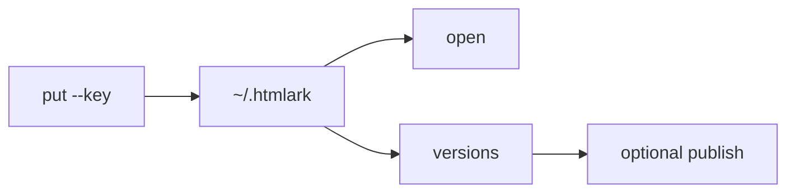

# htmlark

Local library for agent-generated HTML.

[](./LICENSE)
[](https://www.npmjs.com/package/htmlark)
[](https://www.npmjs.com/package/htmlark)

Coding agents write HTML that dies in Downloads or a vendor sidebar. The next session invents a second dashboard.

htmlark is the local origin: put under one key, preview in a loopback sandbox, keep every version. Dirty HTML is stored and does not run. It is not a full Claude Artifacts replacement.

Site: **[htmlark.com](https://htmlark.com)**. Public pages: **[a.htmlark.com](https://a.htmlark.com)**.



## Install

Node 22.13+:

```bash
npx htmlark
```

Or a standalone binary:

```bash
curl -fsSL https://htmlark.com/install.sh | sh
```

Also on [GitHub Releases](https://github.com/nichenqin/htmlark/releases). Notes: [htmlark.com/install](https://htmlark.com/install).

## Quickstart

```bash
printf '%s\n' '<!doctype html><title>demo</title><h1>hello</h1>' > page.html
htmlark put --file ./page.html --key demo --json
htmlark open --id art_…            # id from the put JSON
htmlark publish --id art_… --json  # optional share to a.htmlark.com
```

`npx htmlark` works in place of `htmlark` if you did not install a binary.

Store: `$HTMLARK_HOME` or `~/.htmlark`. Not NFS / iCloud / Dropbox.

## One key. Dirty HTML. Any agent.

- **One key. Every revision.** `put` updates the same artifact. Diff the source. Restore by appending. Tomorrow’s agent does not invent a second dashboard.
- **Dirty HTML is stored. It does not run.** Loopback on `127.0.0.1`. Pages execute inside a CSP sandbox with no network. A failed quality gate stays in the library as dirty (`/render` → 409).
- **Any agent. One library.** Claude Code, Codex, Cursor, OpenCode. Skill, CLI, and MCP call the same `put`. No vendor account required. Data stays on disk.

Share with `htmlark publish` to [a.htmlark.com](https://a.htmlark.com), or `htmlark export`. The local CLI is the source of truth.

## Agents

```bash
htmlark setup   # writes the htmlark-authoring skill
htmlark mcp     # stdio MCP
```

Always `--json` and `--key`. On `code=CONFLICT`, get, re-apply, retry with `--base-version`. Do not `--force`. Do not share loopback URLs.

## Security

Loopback host allowlist. Mutations need JSON + `X-Htmlark-Token`. No CORS. `/render` is CSP-sandboxed (`connect-src` none). Dirty versions 409. No vendor account required.

## Links

- [htmlark.com](https://htmlark.com)
- [Install](https://htmlark.com/install)
- [Public pages](https://a.htmlark.com)
- [Releases](https://github.com/nichenqin/htmlark/releases)
- [npm](https://www.npmjs.com/package/htmlark)

## Layout

`packages/core` commands · `packages/runtime` wrap / CSP · `packages/http` local + publish apps · `apps/cli` sqlite + CAS, MCP · `apps/remote` Cloudflare Worker · `schema/commands.json` catalog.

See [PRD.md](./PRD.md).
